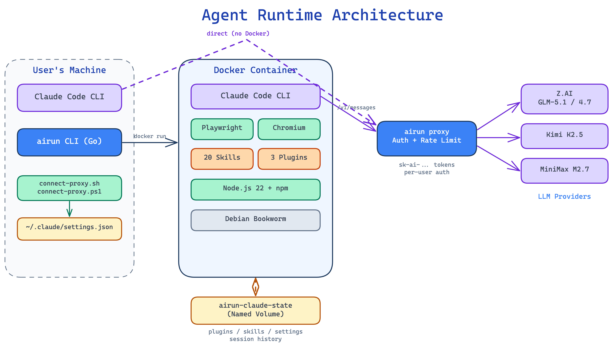

<p align="center">
  
</p>

# Agent Runtime

A CLI tool for running [Claude Code](https://docs.anthropic.com/en/docs/claude-code) agents inside isolated Docker containers with multi-provider model routing.

`airun` wraps Docker to give each agent run a clean, reproducible environment: a non-root user, mounted workspace, injected credentials, and a ready-to-use Claude Code CLI. You choose the model provider, attach a workload profile, and let it run — one-shot, interactive, or in a loop.

## Quick Start — Connect Claude Code to Proxy

If you already have Claude Code installed and received a proxy URL + token from your admin, run one command:

**macOS / Linux:**
```bash
curl -fsSL https://raw.githubusercontent.com/miolamio/agent-runtime/main/scripts/connect-proxy.sh | bash -s -- <PROXY_URL> <API_KEY>
```

**Windows (PowerShell):**
```powershell
$env:PROXY_URL='<PROXY_URL>'; $env:PROXY_KEY='<API_KEY>'
irm https://raw.githubusercontent.com/miolamio/agent-runtime/main/scripts/connect-proxy.ps1 | iex
```

This configures `~/.claude/settings.json` and bypasses authentication dialogs. After that, just run `claude`.

To disconnect and restore original settings:
```bash
curl -fsSL https://raw.githubusercontent.com/miolamio/agent-runtime/main/scripts/connect-proxy.sh | bash -s -- --disconnect
```

---

## Architecture



## Why

Running Claude Code directly on your host works fine for interactive use, but autonomous agents need guardrails: filesystem isolation, credential scoping, reproducible toolchains, and a clean exit every time. `airun` provides all of this with a single command.

## Installation

### Prerequisites

- **Go 1.25+** — to build the CLI
- **Docker** — to run containers (Docker Desktop or Docker Engine)

### Step 1: Build the CLI

```bash
git clone https://github.com/miolamio/agent-runtime.git
cd agent-runtime
go build -o bin/airun ./cmd/airun/
```

### Step 2: Run the setup wizard

```bash
./bin/airun init
```

The wizard walks you through provider selection:

1. **Choose providers** — select which providers to configure (Z.AI, MiniMax, Kimi), with links to sign-up pages
2. **Enter API keys** — each key is validated via a live API call before saving
3. **Set default provider** — pick which provider to use by default
4. **Create directories** — `~/airun-profiles/`, `~/airun-skills/`, `~/.airun/runs/`
5. **Install the binary** — copies `airun` to `~/.local/bin/` and adds it to your `PATH`

After init completes, open a new shell (or `source ~/.zshrc`) so `airun` is available globally.

### Step 3: Build the Docker image

```bash
airun rebuild
```

This builds the `agent-runtime:latest` image from `docker/Dockerfile`. The image includes Claude Code CLI, ripgrep, git-delta, Oh-My-Zsh, and runs as a non-root user.

### Step 4: Verify

```bash
airun --check
```

This shows your configuration, checks that Docker is available, and confirms which provider and model are active.

### Step 5: First run

```bash
# One-shot agent task
airun "List the files in the current directory and describe the project structure"

# Or start an interactive session
airun shell
```

## API keys and configuration

### Where to get API keys

`airun` uses Anthropic-compatible API proxies — third-party providers that expose their own models behind the standard Anthropic API interface. You need an API key from at least one provider:

| Provider | Sign up | What you get |
|----------|---------|--------------|
| **Z.AI** | [z.ai](https://z.ai) | GLM-5.1, GLM-4.7 models via `api.z.ai/api/anthropic` |
| **MiniMax** | [minimax.io](https://minimax.io) | MiniMax-M2.7 model via `api.minimax.io/anthropic` |
| **Kimi** | [kimi.com](https://www.kimi.com/code/docs/en/) | Kimi K2.5 model via `api.kimi.com/coding/` |

You can configure one, two, or all three. Switch between them with `--provider`.

### Managing keys

After initial setup, use `airun keys` to manage providers without re-running the full wizard:

```bash
airun keys list               # show configured keys (masked)
airun keys add kimi            # guided setup: sign-up link, key input, API validation
airun keys remove minimax      # remove a provider key
airun keys test                # validate all configured keys via live API calls
airun keys test kimi           # validate a specific key
airun keys default kimi        # change default provider
```

### Configuration file

All configuration lives in a single file: **`~/.airun.env`**

You can create it with `airun init` (recommended) or write it manually:

```bash
# ~/.airun.env

# ── General ──
ARUN_WORKSPACE=/Users/you/src     # Default directory to mount into containers
ARUN_MODE=snapshot                 # Mount mode: snapshot (copy) or bind (live)
ARUN_PROVIDER=zai                  # Default provider: zai | minimax | kimi | remote

# ── Z.AI ──
ZAI_API_KEY=sk-abc123...           # Your Z.AI API key
ZAI_BASE_URL=https://api.z.ai/api/anthropic
ZAI_MODEL=glm-4.7                 # Primary model
ZAI_HAIKU_MODEL=GLM-4.5-Air       # Fast model

# ── MiniMax ──
MINIMAX_API_KEY=mm-xyz789...       # Your MiniMax API key
MINIMAX_BASE_URL=https://api.minimax.io/anthropic
MINIMAX_MODEL=MiniMax-M2.7        # Primary model

# ── Kimi (Moonshot AI) ──
KIMI_API_KEY=sk-kimi-abc...        # Your Kimi API key
KIMI_BASE_URL=https://api.kimi.com/coding/
KIMI_MODEL=kimi-k2.5              # Primary model

# ── Container ──
API_TIMEOUT_MS=3000000                         # Request timeout (50 min)
CLAUDE_CODE_DISABLE_NONESSENTIAL_TRAFFIC=1     # No telemetry in containers
```

The file is created with `chmod 600` permissions — only your user can read it.

### How credentials flow into containers

```
~/.airun.env                          You store keys here (on host, chmod 600)
    |
    v
airun CLI reads the file               Parses provider API key
    |
    v
Temp env-file in /tmp                  Written with chmod 600, contains:
    |                                    ANTHROPIC_BASE_URL=https://...
    |                                    ANTHROPIC_AUTH_TOKEN=sk-...
    |                                    ANTHROPIC_DEFAULT_SONNET_MODEL=...
    v
docker run --env-file /tmp/.airun-*.env
    |
    v
Container receives env vars           Claude Code reads ANTHROPIC_* vars natively
    |
    v
Temp file is deleted                   Removed automatically after the container exits
```

Credentials never appear in:
- CLI arguments (not visible in `ps aux`)
- Docker inspect output (not stored in container metadata)
- Container logs or run history

### Overriding the provider per run

```bash
# Use Z.AI (default)
airun "your prompt"

# Use MiniMax for this run only
airun --provider mm "your prompt"

# Use Kimi
airun --provider kimi "your prompt"

# Short aliases work too
airun --provider k "your prompt"
```

### Environment variable reference

| Variable | Required | Default | Description |
|----------|----------|---------|-------------|
| `ARUN_WORKSPACE` | No | `~/src` | Directory mounted into containers |
| `ARUN_MODE` | No | `snapshot` | `snapshot` (copy) or `bind` (live mount) |
| `ARUN_PROVIDER` | No | `zai` | Default provider (`zai`, `minimax`, or `kimi`) |
| `ZAI_API_KEY` | Yes* | — | Z.AI API key |
| `ZAI_BASE_URL` | No | `https://api.z.ai/api/anthropic` | Z.AI endpoint |
| `ZAI_MODEL` | No | `glm-4.7` | Z.AI primary model |
| `ZAI_HAIKU_MODEL` | No | `GLM-4.5-Air` | Z.AI fast model |
| `MINIMAX_API_KEY` | Yes* | — | MiniMax API key |
| `MINIMAX_BASE_URL` | No | `https://api.minimax.io/anthropic` | MiniMax endpoint |
| `MINIMAX_MODEL` | No | `MiniMax-M2.7` | MiniMax primary model |
| `KIMI_API_KEY` | Yes* | — | Kimi API key |
| `KIMI_BASE_URL` | No | `https://api.kimi.com/coding/` | Kimi endpoint |
| `KIMI_MODEL` | No | `kimi-k2.5` | Kimi primary model |
| `API_TIMEOUT_MS` | No | `3000000` | Request timeout in milliseconds |
| `CLAUDE_CODE_DISABLE_NONESSENTIAL_TRAFFIC` | No | `1` | Disable telemetry |

*At least one API key is required.

## Usage

```
airun "prompt"                              Run agent task
airun -p dev "prompt"                       Run with profile
airun --provider kimi "prompt"              Run with specific provider
airun shell                                 Interactive Claude Code session
airun shell -p dev                          Interactive with profile
airun shell --mount /path/to/project        Mount a specific directory
airun --loop --max-loops 5 "prompt"         Autonomous loop mode
airun --output ./results "prompt"           Export workspace after run
airun --parallel --agent "a1:task" \
     --agent "a2:task"                     Run agents in parallel
airun history                               Show recent runs
airun keys list                             Show configured API keys
airun keys add <provider>                   Add/replace key with guide
airun keys remove <provider>                Remove provider key
airun keys test [provider]                  Validate keys via API call
airun keys default <provider>               Change default provider
airun keys add remote                       Connect to a remote proxy
airun proxy init                            Create proxy config
airun proxy serve                           Start proxy server
airun proxy user add <name>                 Add user
airun proxy user list                       List users
airun proxy user revoke <name>              Revoke user access
airun proxy user import <file>              Bulk import users
airun proxy user export                     Export user tokens
airun init                                  Interactive global setup
airun rebuild                               Rebuild Docker image
airun rebuild --no-cache                    Rebuild without cache
airun --status                              Show running agents
airun --check                               Show config and prerequisites
airun --version                             Show version
```

### Running from any directory

`airun` automatically mounts your current working directory into the container as `/workspace`. There is no need to run it from a specific location — just `cd` into your project and run.

### Exporting artifacts

By default, changes made by the agent stay inside the container. To save them:

```bash
airun --output ./results "Generate a report on the codebase"
```

This creates the container, runs the task, copies `/workspace` to `./results`, and removes the container.

## Providers

| Alias | Provider | Endpoint | Default model | Context |
|-------|----------|----------|---------------|---------|
| `z`, `zai` | Z.AI | `api.z.ai/api/anthropic` | GLM-5.1 | — |
| `m`, `mm`, `minimax` | MiniMax | `api.minimax.io/anthropic` | MiniMax-M2.7 | — |
| `k`, `kimi` | Kimi (Moonshot AI) | `api.kimi.com/coding/` | Kimi K2.5 | 256K |
| `r`, `remote` | Remote proxy | configurable | configurable | — |

All providers expose the Anthropic Messages API natively — no translation layer needed. The `remote` provider connects to an `airun proxy` instance (see below).

## Proxy

`airun proxy` runs an authenticated API proxy that lets you share model access without sharing API keys. Deploy it on a server, generate per-user tokens, and users connect via `airun keys add remote`.

### Admin workflow

```bash
# 1. Build and upload to your server
GOOS=linux GOARCH=amd64 go build -o bin/airun-linux ./cmd/airun/
scp bin/airun-linux root@your-server:/usr/local/bin/airun

# 2. Initialize proxy config
ssh root@your-server "airun proxy init"
# Edit ~/proxy.yaml to add provider API keys

# 3. Add users
ssh root@your-server "airun proxy user add 'Ivanov'"
#   Ivanov: sk-ai-a1b2c3d4...

# 4. Bulk import from a file (one name per line)
ssh root@your-server "airun proxy user import users.txt"

# 5. Start the proxy
ssh root@your-server "airun proxy serve"
# [proxy] Listening on :8080
# [proxy] Providers: 3 (5 models: glm-5.1, glm-4.7, GLM-4.5-Air, MiniMax-M2.7, kimi-k2.5)
# [proxy] Users: 15 active
```

### User workflow

```bash
airun keys add remote
#   Proxy URL: https://proxy.example.com
#   API key: sk-ai-a1b2c3d4...
#   Fetching models... OK (5 models)
#   Default model: glm-5.1

airun keys default remote
airun shell    # all requests go through the proxy
```

### How it works

```
User (airun)                   Proxy server               Provider (Z.AI, MiniMax, Kimi)
     |                              |                              |
     |-- POST /v1/messages -------->|                              |
     |   x-api-key: sk-ai-...       |                              |
     |                              |-- Auth (user token)          |
     |                              |-- Rate limit (per-user)      |
     |                              |-- Route (model → provider)   |
     |                              |                              |
     |                              |-- POST /v1/messages -------->|
     |                              |   x-api-key: real-key        |
     |                              |   User-Agent: claude-cli/... |
     |                              |                              |
     |                              |<-------- response -----------|
     |<-------- response -----------|                              |
```

The proxy only replaces `x-api-key` and `User-Agent` headers. Everything else — request body, streaming, response — passes through unchanged.

### Proxy configuration

```yaml
# ~/proxy.yaml
listen: ":8080"
rpm: 0                # 0 = no limit; >0 = per-user requests per minute
user_agent: "claude-cli/2.1.80 (external, cli)"

providers:
  zai:
    base_url: "https://api.z.ai/api/anthropic"
    api_key: "your-key"
    models:
      - glm-5.1
      - glm-4.7
  minimax:
    base_url: "https://api.minimax.io/anthropic"
    api_key: "your-key"
    models:
      - MiniMax-M2.7
```

Users are stored in `~/students.json`, managed via `airun proxy user` commands.

## Profiles

Profiles bundle a provider, a set of skills, Claude Code plugins, and settings into a reusable configuration.

```yaml
# ~/airun-profiles/dev.yaml
name: dev
description: Full-stack development
provider: z
skills:
  - claude-code-best-practices
  - webapp-testing
plugins:
  - superpowers@superpowers-marketplace
  - context7@claude-plugins-official
settings:
  effortLevel: high
  alwaysThinkingEnabled: true
```

Skills listed in the profile are loaded from `~/airun-skills/<skill-name>/` and mounted read-only into the container at `/home/claude/.claude/skills/`.

Three profiles ship as templates: **default**, **dev**, and **text** (Russian text editing and translation).

```bash
airun -p dev "Refactor the authentication module"
airun -p text "Translate README.md to Russian"
```

## Docker image

The `agent-runtime:latest` image is built from `docker/Dockerfile`:

- **Base:** `buildpack-deps:bookworm-scm`
- **Tools:** ripgrep, fd-find, jq, fzf, git-delta, Oh-My-Zsh
- **Runtime:** Claude Code CLI, non-root user (`claude:1001`), gosu
- **SSH:** known hosts for GitHub, GitLab, and Bitbucket (fetched at build time)
- **Config:** entrypoint seeds Claude Code settings and forwards host git config

Rebuild anytime with `airun rebuild` (or `airun rebuild --no-cache` for a clean build).

## Project structure

```
agent-runtime/
├── cmd/airun/main.go              CLI entry point
├── internal/
│   ├── config/                   ~/.airun.env loader
│   ├── envfile/                  Temp env-file for credential security
│   ├── history/                  Run history storage
│   ├── keys/                    Key management (add, remove, test, list)
│   ├── proxy/                   API proxy server with user auth
│   │   └── students/            User CRUD, token generation
│   ├── monitor/                  Container status (docker ps)
│   ├── prereq/                   Prerequisite checks
│   ├── profile/                  YAML profile loader
│   ├── runner/                   Docker run, export, parallel execution
│   └── setup/                    airun init wizard
├── docker/
│   ├── Dockerfile                Container image definition
│   ├── entrypoint.sh             Container startup script
│   └── settings.json             Default Claude Code settings
├── configs/
│   ├── airun.env.example          Config file template
│   ├── profiles/                 Profile templates (dev, text, default)
│   └── init/                     Container init manifest
├── scripts/
│   ├── setup.sh                  Host setup script
│   └── init-container.sh         Container post-init script
└── examples/
    ├── skills/                   Example skills
    ├── agents/                   Example agent definitions
    └── commands/                 Example commands
```

## Platform support

| Platform | Status | Notes |
|----------|--------|-------|
| **macOS** | Supported | Primary development platform |
| **Linux** | Supported | Native Docker, no issues expected |
| **Windows + WSL2** | Should work | WSL2 is Linux under the hood |
| **Windows native** | Not yet supported | See below |

### Windows limitations

Running `airun` natively on Windows (without WSL) will hit several issues:

- **File permissions** — `chmod 600` on the temp env-file is a no-op on Windows, leaving credentials world-readable
- **Docker volume paths** — `C:\Users\...:/workspace` mounts are fragile in Docker Desktop
- **`airun init`** — writes to `~/.zshrc`, which doesn't exist; needs PowerShell `$PROFILE` support
- **`airun shell`** — interactive TTY behaves differently in cmd.exe/PowerShell
- **Shell scripts** — `scripts/setup.sh` requires bash

**Recommendation:** on Windows, use WSL2 with Docker Desktop's WSL backend.

## Roadmap

- [ ] Windows native support (PowerShell profile, ACL-based permissions, path normalization)
- [ ] Anthropic API as a first-party provider
- [ ] Container init from profile (auto-install plugins, npm/pip packages)
- [ ] Proxy: auto-reload users on file change (without SIGHUP)
- [ ] Proxy: per-user daily usage limits and quotas

## License

MIT License. See [LICENSE](LICENSE) for details.
